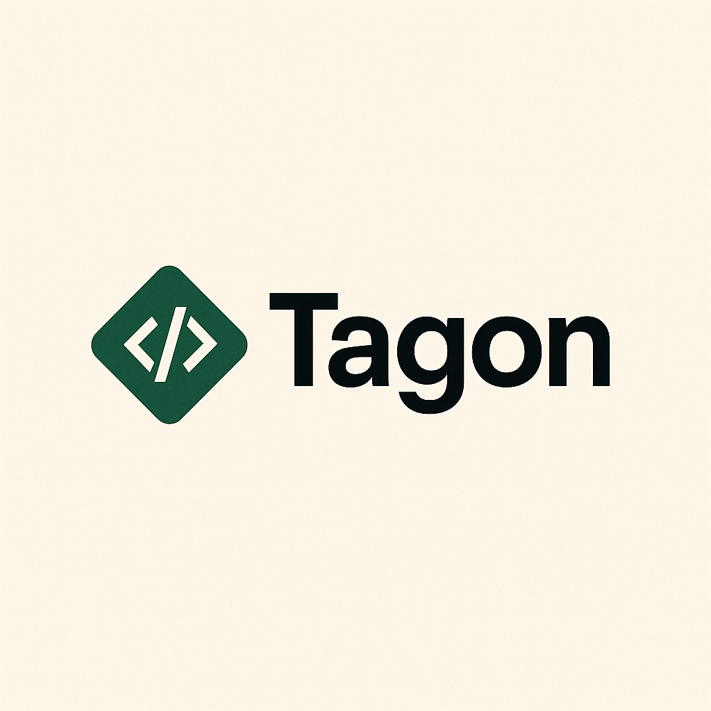

<p align="center">
  
</p>

<h1 align="center">TagonPy</h1>
<p align="center">
  <b>Framework Web Moderno & Reativo em Python</b><br/>
  <i>Desenvolva aplicações web de alta qualidade com componentes Python + HTML + CSS</i>
</p>

---

## ✨ Visão Geral

TagonPy é um framework web moderno, reativo e minimalista, que permite criar aplicações web usando componentes `.tg` com sintaxe intuitiva, unindo Python, HTML, CSS e Jinja2. Ideal para quem deseja produtividade, hot reload e integração total com o ecossistema Python.

---

## 🚀 Principais Recursos

- ⚡ **Desenvolvimento instantâneo** com FastAPI + Uvicorn
- 🔥 **Hot Reload** automático de componentes e estilos
- 🎨 **Componentes .tg**: Python, HTML, CSS e Jinja2 em um só arquivo
- 🧩 **Sintaxe moderna** e fácil de aprender
- 🛠️ **Extensão oficial para VSCode** (syntax highlight, ícones, folding)
- 📦 **Zero configuração**: pronto para usar
- 📱 **Design responsivo** e dark mode nativo

---

## 📦 Instalação

```bash
# Clone o repositório
$ git clone https://github.com/esc4n0rx/tagonpy.git
$ cd tagonpy

# Instale as dependências
$ pip install -r requirements.txt

# Inicie o servidor de desenvolvimento
$ python main.py
```

Acesse: [http://localhost:3000](http://localhost:3000)

---

## 🏷️ Estrutura de Componentes `.tg`

Cada componente `.tg` possui 4 seções principais:

```text
Imports: # (opcional) imports Python
Funcoes: # (opcional) funções Python
Html:    # (obrigatório) HTML + Jinja2
Css:     # (opcional) CSS do componente
```

### Exemplo de componente `App.tg`

```tg
Imports: from datetime import datetime

Funcoes:
def saudacao():
    return "Olá, mundo do TagonPy!"

Html:
<div>
    <h1>{{ saudacao() }}</h1>
    <p>Bem-vindo ao TagonPy 🚀</p>
</div>

Css:
h1 {
    color: #4caf50;
    text-align: center;
}
```

- Use `{{ ... }}` para variáveis/funções Python (Jinja2)
- Use `` para lógica de template
- O CSS pode ser inline (na seção Css) ou externo (`App.css`)

---

## 🖥️ Exemplo de Interface

A interface padrão inclui uma seção hero, estatísticas, cards de features e status do servidor. O CSS principal está em `components/App.css`.

---

## 🛠️ Extensão de Sintaxe para VSCode

- **Realce de sintaxe** para arquivos `.tg`
- **Ícones personalizados**
- **Folding por seções**
- **Auto-complete básico**

### Instalação manual

1. No VSCode, pressione `Ctrl+Shift+P` → `Extensions: Install from VSIX...`
2. Selecione o arquivo `tagonpy-syntax/tagonpy-syntax-1.0.1.vsix`

Mais detalhes em [`tagonpy-syntax/README.md`](tagonpy-syntax/README.md)

---

## ⚙️ Dependências

- fastapi
- uvicorn
- jinja2
- watchdog
- websockets
- aiofiles

---

## 📂 Estrutura do Projeto

```
components/         # Componentes .tg e CSS
core/               # Núcleo do framework (parser, renderer, server)
public/static/      # Arquivos estáticos (logo, imagens)
templates/          # Templates base (Jinja2)
tag...py-syntax/    # Extensão de sintaxe para VSCode
main.py             # Entrada do servidor
```

---

## 🧑‍💻 Contribuição

Pull requests são bem-vindos! Sinta-se à vontade para propor melhorias, novos recursos ou correções.

---

## 📄 Licença

MIT 
